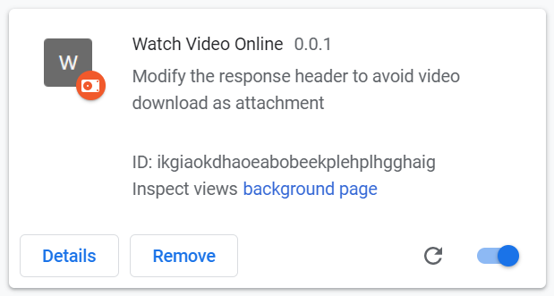

# Watch Video Online ChromeExtension

這個 Chrome 擴充套件主要的目的是避免特定影片被強迫從瀏覽器下載，強迫讓影片直接在 Chrome 瀏覽器中播放！

## 安裝方式

1. 開啟 `chrome://extensions/` 頁面

2. 右上角開啟 **開發人員模式** (Developer mode)

3. 點擊左上角 **Load unpacked** 按鈕，並選取本專案 Clone 下來的資料夾

    你會看到一個 **Watch Video Online** 的擴充套件

    

## 技術原理

HTTP Response Header 有個 `Content-Disposition` Header 可以控制檔案是否要強制下載，常見的 Header 長這樣：

```txt
Content-Disposition: inline
Content-Disposition: attachment
Content-Disposition: attachment; filename="filename.jpg"
```

如果設定為 `attachment` 就會強迫下載，而且可以指定 `filename` 自訂檔名。

如果設定為 `inline` 就不會強迫下載，而是直接在 Chrome 裡面開啟！

> [Content-Disposition - HTTP | MDN](https://developer.mozilla.org/en-US/docs/Web/HTTP/Headers/Content-Disposition)

不過，如果 `Content-Type` 設定為 `application/octet-stream` 或 `application/x-download` 的話，其實也會強迫瀏覽器下載檔案。

所以，如果你真的希望不要讓檔案下載的話，這兩個 Header 都需要進行微調才行。

## 所有影音檔案的 MIME Type 清單

| 格式名稱        | MIME type       | 常見副檔名 |
| --------------- | --------------- | ---------- |
| 3GP             | video/3gpp      | .3pg       |
| MPEG-1 / MPEG-2 | video/mpeg      | .mpg       |
|                 |                 | .mpeg      |
| MPEG-4          | video/mp4       | .mp4       |
|                 |                 | .m4v       |
|                 |                 | .m4p       |
| Ogg             | video/ogg       | .ogv       |
|                 |                 | .ogg       |
| QuickTime Movie | video/quicktime | .mov       |
| WebM            | video/webm      | .webm      |
